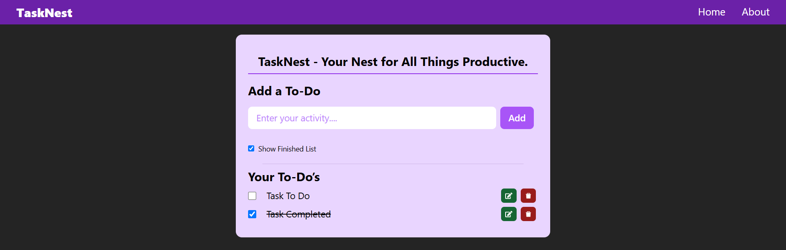

# TaskNest - Your Nest for All Things Productive

TaskNest is a simple, user-friendly To-Do List app built with **React** and styled using **Tailwind CSS**. It allows users to manage their tasks by adding, editing, deleting, and marking them as complete. The app persists your tasks using **localStorage**, and you can toggle between showing completed or active tasks.

## Features

- **Add Tasks**: Easily add new tasks to your list.
- **Edit Tasks**: Modify the details of any task.
- **Delete Tasks**: Remove tasks from the list.
- **Mark Tasks as Complete**: Check tasks as completed.
- **Show Finished Tasks**: Toggle visibility of completed tasks.
- **Persistent Storage**: Tasks are saved in **localStorage** to persist even after the page is refreshed.

## Technologies Used

- **React** (for the app's UI and state management)
- **Tailwind CSS** (for responsive, utility-first CSS styling)
- **React Icons** (for edit and delete icons)
- **uuid** (for unique task IDs)

## Installation

### Prerequisites

Ensure you have the following installed:

- **Node.js** (v16 or later)
- **npm** (Node Package Manager)

### Clone the Repository

```bash
git clone https://github.com/ksaiprashanth/task-nest.git
cd task-nest
```

### Install Dependencies

Run the following command to install the required dependencies:

```bash
npm install
```

### Run the Development Server

Start the development server to view the app locally:

```bash
npm run dev
```

Visit `http://localhost:3000` in your browser to see the app in action.

## Usage

### How to Use the App

1. **Adding a Task**: Type your task in the input box and click the "Add" button.
2. **Marking a Task as Completed**: Click the checkbox next to a task to mark it as completed. The task will appear with a strikethrough.
3. **Editing a Task**: Click the edit icon (`✎`) to modify a task.
4. **Deleting a Task**: Click the delete icon (`🗑`) to remove a task from the list.
5. **Toggling Finished Tasks**: Use the checkbox at the top to show or hide completed tasks.

### Clearing LocalStorage

Tasks are stored in `localStorage`, which means that even if you refresh the page, your tasks will persist. If you want to reset your tasks, you can clear the browser's **localStorage**.

## Deployment

To deploy this app to GitHub Pages:

1. Make sure your app is working locally (`npm run dev`).
2. Build the production version:

```bash
npm run build
```

3. Deploy to GitHub Pages by running the following:

```bash
npm run deploy
```

This will create a production build of your app and push it to the `gh-pages` branch of your repository.

4. Go to your GitHub repository's **Settings** tab.
5. In the **Pages** section, select the `gh-pages` branch as the source for GitHub Pages.
6. Your app will be live at `https://your-username.github.io/repository-name/`.

## License

This project is licensed under the MIT License - see the [LICENSE](LICENSE) file for details.

---

### How the App Works

- **State Management**: The app uses `useState` to manage the current to-do input (`todo`) and the list of to-dos (`toDos`). It also tracks whether completed tasks should be shown (`showFinished`).
  
- **LocalStorage**: The app persists the to-do list to `localStorage` using `localStorage.setItem` and retrieves it on page load using `localStorage.getItem`. This ensures that tasks persist even if the page is refreshed.

- **Sorting Tasks**: Tasks are sorted based on completion status using JavaScript’s `sort` method to display incomplete tasks first, followed by completed tasks.

- **Icons**: The app uses `react-icons` for the edit (`FaEdit`) and delete (`AiFillDelete`) icons.

---

### App Screenshots



---

### Notes

- You can customize the app further by modifying the **Tailwind CSS** classes or adding additional features.
- If you encounter any issues or want to contribute, feel free to open an issue or submit a pull request!

---
